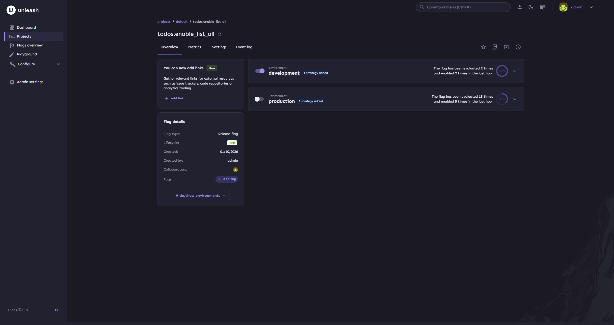

# go-feature-management

[](https://goreportcard.com/report/github.com/ductran999/go-feature-management)
[](https://golang.org)
[](LICENSE)


A simple Proof of Concept (PoC) project to explore Unleash feature flag management using Go.
This project is not production-ready. Its goal is to understand how Unleash works, how feature flags are evaluated, and how it can be integrated into a Go service.

## 🎯 Purpose
- Learn how Unleash evaluates feature flags
- Experiment with Unleash Go client
- Understand feature toggles, strategies, and context
- Validate if Unleash fits real-world Go services

## 🧪 Scope (PoC)

- Basic feature flag enable/disable
- Context-based evaluation (user, environment)
- Simple Unleash client integration
- No persistence, no caching strategy optimization
- No advanced rollout strategies

## 📦 Tech Stack

- Go
- Unleash
- Unleash Go Client

## 🚀 Getting Started

### 1. Clone project
```bash
git clone https://github.com/ductran999/go-feature-management.git
cd go-feature-management
```

### 2. Start demo
```bash
make demo
```

Unleash UI: http://localhost:4242 (Default credentials: admin / unleash4all)

### 3. Config flag
```go
// internal/application/usecase/list_todos_usecase.go
func (uc *listTodoUsecase) Execute(ctx context.Context) ([]domain.Todo, error) {
    // evaluate flag
	if !uc.flags.IsEnabled("todos.enable_list_all") {
		return nil, ErrFeatureIsDisabled
	}

	todos, err := uc.todoRepo.List(ctx)
	if err != nil {
		return nil, err
	}

	return todos, nil
}
```

Create a flag: `todos.enable_list_all` and disable it production


### Result

curl production

```bash
curl --location 'localhost:8080/todos'
```

output:
```json
{
    "code": "GONE",
    "message": "feature is disabled"
}
```

curl dev

```bash
curl --location 'localhost:8081/todos'
```

output:
```json
{
  "data": [
    {
      "ID": 1,
      "Title": "Learn Unleash feature flags",
      "Status": "pending",
      "CreatedAt": "2026-01-10T13:59:27.20761Z",
      "UpdatedAt": "2026-01-10T13:59:27.20761Z"
    },
    {
      "ID": 2,
      "Title": "Build todo API",
      "Status": "in_progress",
      "CreatedAt": "2026-01-10T13:59:27.20761Z",
      "UpdatedAt": "2026-01-10T13:59:27.20761Z"
    },
    {
      "ID": 3,
      "Title": "Refactor initUnleash function",
      "Status": "in_progress",
      "CreatedAt": "2026-01-10T13:59:27.20761Z",
      "UpdatedAt": "2026-01-10T13:59:27.20761Z"
    },
    {
      "ID": 4,
      "Title": "Write README for PoC",
      "Status": "done",
      "CreatedAt": "2026-01-10T13:59:27.20761Z",
      "UpdatedAt": "2026-01-10T13:59:27.20761Z"
    }
  ],
  "message": "retrieve list todos successfully!"
}
```

---

## 📄 License

This project is licensed under the [MIT](LICENSE) License.
